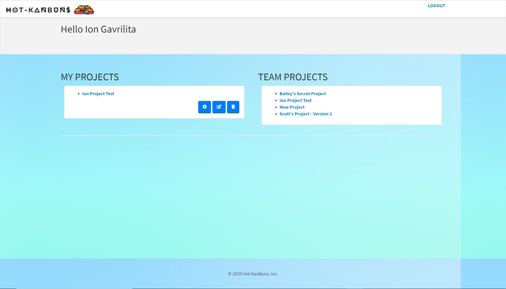
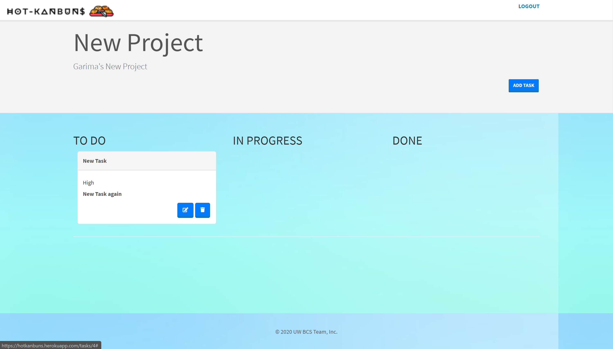

# Hot-Kanbuns
An easy-to-use  kanban app that allows users to keep track of the progression of multiple projects using the "To Do", "In Progress" and "Done" categories, as well as mark task priority.
## README contents:
* [User Story](#User-Story)
* [Images with application functionality](#Images-with-application-functionality)
* [Tech/framework used](#Tech/framework-used)
* [Project Link & Repository](#Project-Link-&-Repository)
* [How to Install](#How-to-Install)
* [Contributors](#Contributors)
* [License](#License)
## User Story
```
User Story:
AS A web dev student, I have many assignments and projects to keep track of
I WANT to be able to have a visual of my workflow based on status (To-Do, In Progress, Done), as well as the priority of each task
SO THAT I can better organize and manage my work and my time
```
### Images with application functionality:
| Project page    | Task page | 
|------------|------------|------------|
|  |  |
### Tech/framework used:
* Node.js:
    * `express`
    * `handlebars`
    * `passport`
    * `sequelize`
    * `dotenv`
    * `express`
    * `mysql2`
    * `nodemon`
* Bootstrap
* Jquery
* Handlebars
## Project Link & Repository
- App Link- [Heroku](https://hotkanbuns.herokuapp.com/)
- Repository Link - [GitHub](https://github.com/UW-BCS-TEAM/Hot-KanBuns/)
## How to Install
In order to install and run this project on your local machine you need to follow the next steps:
1) Fork the GitHub project to your local machine.
2) In your terminal type `npm i` to install all node packages.
3) Open the project and find file `.env` and add your MySql password.
4) Open MySql Workbench and run the `schema.sql`.
5) In your terminal type `node server.js`, it should show you that app is running on your local server 8080.
6) Open your browswer and type `http://localhost:8080/`.
Now you should have running this app on your local machine.
## Contributors
* [@garimaggupta](https://github.com/garimaggupta)
* [@IonGavrilita](https://github.com/IonGavrilita)
* [@snelson-seattle](https://github.com/snelson-seattle)
* [@baileymclem](https://github.com/baileymclem)
## License
This project is licensed under MIT
[](https://opensource.org/licenses/MIT)